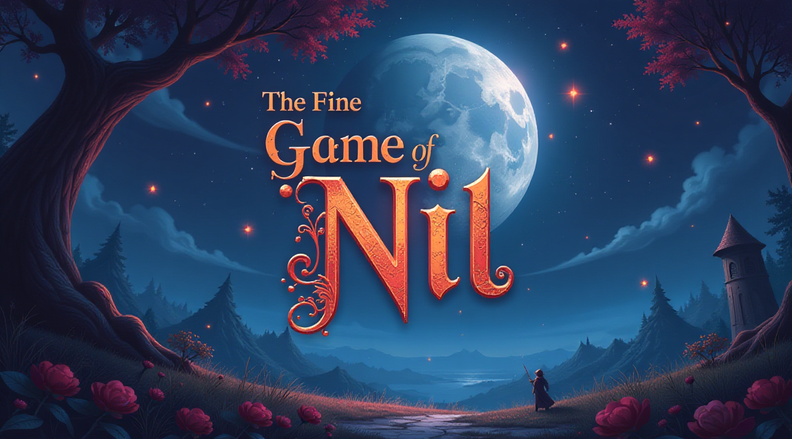

# The Fine Game of Nil (TFGON)



A tactical trading card game built with LÖVE2D framework, combining elements of traditional card games with chess-like positioning and movement.

## Description

The Fine Game of Nil (TFGON) is a unique turn-based digital card game where two players battle on a strategic grid-based board. Players deploy minions with various movement patterns and abilities, cast spells, and wield weapons to destroy their opponent's towers while protecting their own.

## Core Features

- **Grid-Based Combat System**: Chess-like tactical gameplay on various board layouts
- **Multiple Board Layouts**: Several pre-designed arenas with different tactical considerations:
  - Standard Arena (9x9)
  - Wide Arena (11x8)
  - Compact Arena (7x7)
  - Open Field (8x8)
  - Quad Arena (8x8 with dual towers)
- **Tower Defense**: Players must protect their towers while attacking the opponent's
- **Diverse Unit Types**:
  - Melee Units (1-tile range)
  - Ranged Units (3-tile range)
  - Magic Units (2-tile range)
- **Card Types**:
  - Minions with movement, attack, and health stats
  - Spells with powerful immediate effects
  - Weapons that enhance your hero's combat ability
- **Deck Building**: Create and customize decks in the Collection interface
- **AI Opponent**: Adjustable AI difficulty levels for single-player games

## Prerequisites

- LÖVE2D (version 11.4 or higher) - [Download Here](https://love2d.org/)

### Installation Instructions

1. Install LÖVE2D for your operating system:
   - **Windows**: Download and install from love2d.org
   - **macOS**: `brew install love` (using Homebrew)
   - **Linux**: `sudo apt-get install love` (Ubuntu/Debian)

2. Clone this repository:
```bash
git clone https://github.com/yourusername/nymbo-tfgon.git
cd nymbo-tfgon
```

3. Run the game:
   - **Windows**: Drag the game folder onto love.exe, or run `"C:\Program Files\LOVE\love.exe" .` from the game directory
   - **macOS**: `love .` from the game directory
   - **Linux**: `love .` from the game directory

## How to Play

### Starting the Game
1. Launch the game
2. Click "Play" in the main menu
3. Select your deck and preferred board layout
4. Choose whether to play against AI or another player
5. Starting conditions:
   - Each player has towers to protect
   - 3 cards in starting hand
   - 0 initial mana crystals

### Game Mechanics
- **Turn Structure**:
  - Gain one mana crystal (up to 10)
  - Draw one card
  - Play cards and move units
  - Attack with units and hero
- **Movement and Combat**:
  - Units can move based on their movement stat
  - Different unit types have different attack ranges
  - Positioning is crucial for tower defense and offense
- **Winning the Game**:
  - Destroy all enemy towers to win
  - Protect your own towers to survive

### Card Types and Statistics
- **Minions**:
  - Movement: How many tiles they can move per turn
  - Attack: Damage dealt in combat
  - Health: Amount of damage they can take
  - Archetype: Determines attack range (Melee/Ranged/Magic)
- **Spells**: One-time powerful effects
- **Weapons**: Equip your hero with attack power

## Development Architecture

The game is built using the LÖVE2D framework and pure Lua, with a modular architecture:

- **Core Systems**:
  - Scene Management
  - Board Mechanics
  - Combat Resolution
  - AI Decision Making
- **Rendering Systems**:
  - Board Visualization
  - Card Display
  - UI Elements
- **Game Management**:
  - Turn Structure
  - Player Actions
  - State Tracking
  - Effect Resolution

## Contributing

1. Fork the repository
2. Create a feature branch: `git checkout -b new-feature`
3. Commit your changes: `git commit -am 'Add new feature'`
4. Push to the branch: `git push origin new-feature`
5. Submit a pull request

### Development Guidelines
- Follow the established code structure
- Maintain consistent commenting style
- Add unit tests for new features
- Update documentation as needed

## License

This project is licensed under the DAE Ventures Non-Commercial License - see the LICENSE file for details.

## Acknowledgments

Special thanks to the LÖVE2D community and contributors who have helped shape this project.